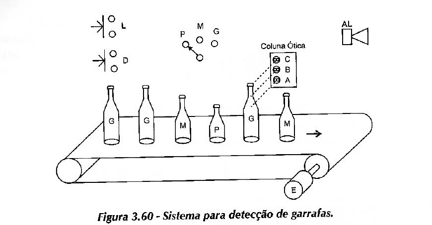

### 3.4)
Elaborar um programa PLC para processo industrial em que uma esteira acionada pelo motor E transporta garrafas de três tamanhos (pequena, média e grande) que sensibilizam três sensores ópticos A, B, C, conforme ilustra a figura 3.60. 

O processo tem início quando a botoeira L é acionada, e interrompido pela botoeira D. A seleção do tipo de garrafa é feita a partir de uma chave seletora de três posições (P, M e G). Assim, caso, por exemplo, sejam selecionadas garrafas grandes, a esteira deve parar e o alarme AL soar caso uma garrafa pequena ou média seja detectada. Após a retirada manual da garrafa indesejada, o operador deve religar o sistema em L.