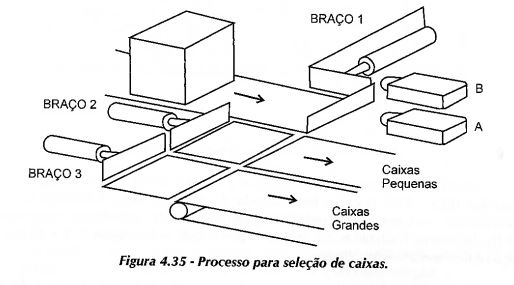

### 4.2)
Elaborar um Grafcet para um dispositivo automático destinado a selecionar caixas de dois tamanhos diferentes, que se compõe de uma esteira rolante de alimentação de caixas, de um dispositivo de detecção que permite reconhecer sem ambiguidade o tipo de caixa presente, de três cilindros pneumáticos comandados por eletroválvulas, de sensores de posição para cada cilindro, sendo Pl (posição inicial), PM (posição média), PF (posição final) e de duas esteiras rolantes de saída. O braço (1) empurra as caixas pequenas diante do braço (2) e este as translada sobre a esteira de saída para caixas pequenas. O braço empurra as caixas grandes diante do braço (3) e este as translada para a esteira de saída de caixas grandes. O detector (A) percebe a presença de uma caixa e o detector (B) identifica o tamanho da caixa, pois atua quando ela for do tipo grande, conforme ilustra a Figura 4.35.

