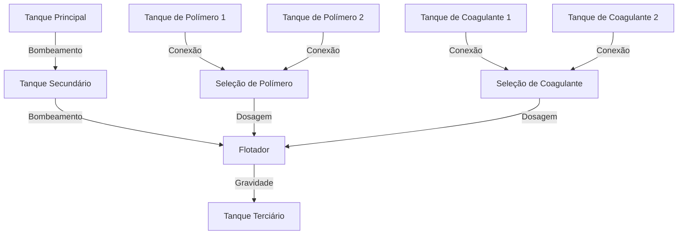

# ETE - Processo de Fabricação de Papel

## 1. Introdução

A indústria papeleira desempenha um papel importante na economia, especialmente na região do meio oeste catarinense, onde a atividade está profundamente ligada ao desenvolvimento econômico local e à geração de empregos. O processo de fabricação de papel consome uma quantidade significativa de água em várias etapas, desde a preparação da polpa até o tratamento de resíduos, o que torna o gerenciamento eficiente desse recurso um ponto crucial para a sustentabilidade e competitividade da indústria.

No processo principal de fabricação, a água é utilizada de maneira intensiva e, ao longo das diversas etapas, grande parte dessa água é recuperada e reciclada. No entanto, a eficiência desse reaproveitamento depende diretamente de um controle preciso e de processos bem gerenciados de tratamento da água excedente. Neste contexto, o tratamento de água desempenha um papel fundamental, pois permite não apenas o reaproveitamento, mas também a melhoria da qualidade da água e a recuperação de fibras, aumentando a eficiência e reduzindo os impactos ambientais.

### 1.1. Justificativa

O tratamento de água na indústria de papel é crítico tanto pela importância da água no processo quanto pela necessidade de práticas sustentáveis que reduzam o impacto ambiental. Sem automação e controle adequados, há uma perda significativa de água e fibras, o que acarreta aumento nos custos de produção e consumo de recursos naturais.

A analogia com a falta de automação é clara: imagine que, sem um controle preciso, a quantidade de fibras de papel que poderia ser recuperada e reinserida no processo é perdida para o efluente, representando um custo oculto, mas significativo. O tratamento manual, sem a devida automação, também pode resultar em variações na qualidade da água tratada, afetando as etapas seguintes de produção e a consistência do produto final.

### 1.2. Problema

O problema central reside na ausência de automação adequada do processo de tratamento de água, que atualmente é realizado de forma manual. Isso resulta em uma série de desafios operacionais, como:

- **Perda de Recursos**: Fibras de papel que poderiam ser recuperadas são frequentemente descartadas, aumentando os custos de matéria-prima.
- **Ineficiência no Uso de Água**: A falta de controle sobre os níveis de água, bem como a dosagem de produtos químicos, leva ao desperdício, aumentando o consumo de água e afetando a eficiência da operação.
- **Qualidade Inconsistente**: O controle manual também implica em variações na dosagem de coagulantes e polímeros, o que pode afetar a qualidade da água tratada e o desempenho do processo produtivo como um todo.

### 1.3. Objetivo

O objetivo deste documento é descrever o subprocesso de tratamento de água utilizado no processo principal de fabricação de papel e propor a implementação de automação para otimizar o uso da água e a recuperação de fibras. Com a automação, busca-se alcançar maior eficiência e sustentabilidade, minimizando desperdícios e melhorando a consistência e a qualidade do processo.

### 1.4. Escopo

O escopo do projeto abrange a análise detalhada dos equipamentos e processos envolvidos no tratamento da água excedente, com foco na otimização através de técnicas de controle e automação. Será elaborado um plano para implementação de sensores e sistemas automatizados para monitoramento dos níveis de água e dosagem dos produtos químicos, além de sistemas de alarme e segurança que garantam a operação dentro dos parâmetros desejados.

## 2. Diagramação

O diagrama a seguir ilustra o subprocesso de tratamento de água no processo de fabricação de papel, destacando os equipamentos envolvidos e o fluxo operacional, incluindo os tanques de polímero e coagulante que dosam diretamente no flotador.

## 3. Equipamentos Envolvidos

### 3.1. Tanque Principal (Tanque 1)

- **Função**: Capta toda a água excedente utilizada no processo de fabricação de papel.
- **Capacidade**: 80 metros cúbicos.
- **Bombeamento**: Realizado por uma bomba sapo com capacidade de 100 metros cúbicos por hora.
- **Transporte**: A água do Tanque Principal é transportada para o Tanque Secundário.

### 3.2. Tanque Secundário (Tanque 2)

- **Função**: Recebe a água do Tanque Principal e alimenta o flotador.
- **Capacidade**: 36 metros cúbicos.
- **Bombeamento**: Duas bombas de 20 cavalos, cada uma fornecendo 100 metros cúbicos de água por hora.
- **Transporte**: A água do Tanque Secundário é bombeada para o flotador.

### 3.3. Flotador

- **Função**: Realiza a flotação das fibras de papel da água e arrasta as fibras para recuperação e a água para reaproveitamento.
- **Capacidade**: 100 metros cúbicos por hora.
- **Produtos Químicos**: São aplicados para auxiliar na separação das fibras de papel.
- **Destino da Água**: Após o tratamento, a água segue para o Tanque Terciário.

### 3.4. Tanque Terciário (Tanque 3)

- **Função**: Armazena a água tratada do Flotador e retroalimenta o processo, evitando a dispersão e permitindo o reaproveitamento da água.
- **Capacidade**: 40 metros cúbicos.
- **Bombeamento**: Realizado por uma bomba de 1 cavalo.
- **Abastecimento**: Alimentado pela água tratada do Flotador.

### 3.5. Tanque de Polímero 1 (Tanque 4)

- **Função**: Armazena o polímero catiônico utilizado no tratamento de água.
- **Capacidade**: 1,8 metros cúbicos.
- **Bombeamento**: Realizado por uma bomba de 1 cavalo.
- **Abastecimento**: Registro de água para diluição do polímero catiônico antes da aplicação no flotador.
- **Válvula de Saída**: Válvula de controle para dosagem do polímero no flotador.
- **Dosagem**: O polímero é dosado no flotador para auxiliar na separação das fibras de papel.

### 3.6. Tanque de Polímero 2 (Tanque 5)

- **Função**: Armazena o polímero catiônico utilizado no tratamento de água.
- **Capacidade**: 1,8 metros cúbicos.
- **Bombeamento**: Realizado por uma bomba de 1 cavalo.
- **Abastecimento**: Registro de água para diluição do polímero catiônico antes da aplicação no flotador.
- **Válvula de Saída**: Válvula de controle para dosagem do polímero no flotador
- **Dosagem**: O polímero é dosado no flotador para auxiliar na separação das fibras de papel.

### 3.7. Tanque de Coagulante (Tanque 6)

- **Função**: Armazena o coagulante utilizado no tratamento de água.
- **Capacidade**: 1,2 metros cúbicos.
- **Bombeamento**: Realizado por uma bomba de 1 cavalo.
- **Abastecimento**: Registro de água para diluição do coagulante antes da aplicação no flotador.
- **Válvula de Saída**: Válvula de controle para dosagem do coagulante no flotador
- **Dosagem**: O coagulante é dosado no flotador para auxiliar na separação das fibras de papel.

### 3.8. Tanque de Coagulante 2 (Tanque 7)

- **Função**: Armazena o coagulante utilizado no tratamento de água.
- **Capacidade**: 1,2 metros cúbicos.
- **Bombeamento**: Realizado por uma bomba de 1 cavalo.
- **Abastecimento**: Registro de água para diluição do coagulante antes da aplicação no flotador.
- **Válvula de Saída**: Válvula de controle para dosagem do coagulante no flotador
- **Dosagem**: O coagulante é dosado no flotador para auxiliar na separação das fibras de papel.

## 4. Fluxo Operacional

1. A água excedente utilizada no processo principal de fabricação de papel é direcionada ao Tanque Principal.
2. A bomba sapo do Tanque Principal transporta a água para o Tanque Secundário.
3. No Tanque Secundário, uma das bombas abastece o flotador.
4. É aplicado um coagulante para auxiliar na flotação das fibras de papel.
5. É preparado e aplicado um polímero catiônico para aplicação no flotador, auxiliando na separação das fibras de papel.
6. No flotador, produtos químicos são aplicados para separar as fibras de papel da água. O operador ajusta manualmente a vazão de água e a quantidade de produtos químicos.
7. O Tanque Terciário retroalimenta o processo, reutilizando quase toda a água, reduzindo o desperdício.

## 5. Controle

O controle preciso dos níveis de água é crucial para evitar excesso ou escassez no sistema. É necessário equilibrar a quantidade de água consumida no processo de fabricação com a quantidade recuperada pelo flotador e armazenada nos tanques, sendo necessário monitorar a qualidade da água e a eficiência do tratamento. A aplicação dos produtos químicos deve ser ajustada conforme a necessidade, evitando excesso ou falta de produtos.

- **Tanque 1**: O nível deve ser mantido em 50% de sua capacidade para evitar transbordamento e garantir que a água seja bombeada para o Tanque 2.
- **Tanque 2**: Deve estar sempre em 100% de capacidade para garantir o abastecimento do flotador. Um medidor de fluxo na tubulação de saída deve ser monitorado para garantir a dosagem proporcional de produtos químicos.
- **Flotador**: Um sensor de nível deve ser monitorado para ativar ou desligar o equipamento conforme a necessidade.
- **Tanque 3**: O nível deve ser monitorado para garantir que a água seja direcionada para o processo de fabricação de papel. Se o nível estiver abaixo de 10%, a bomba principal deve ser acionada para bombear para o Tanque 3. Se o nível estiver acima de 90%, a bomba principal deve ser desligada para evitar transbordamento.

## 6. Lista de Materiais Necessários

1. **Bombas de Água**

   - 1 Bomba sapo (capacidade: 100 m³/h)
   - 2 Bombas de 20 cavalos (capacidade: 100 m³/h cada)
   - 1 Bomba de 1 cavalo para tanques de polímero
   - 1 Bomba de 1 cavalo para tanques de coagulante
   - 1 Bomba de 10 cavalos para a captação de água do rio para eventuais faltas de água no tanque terciário

2. **Tanques de Armazenamento**

   - Tanque Principal (80 m³)
   - Tanque Secundário (36 m³)
   - Tanque Terciário (40 m³)
   - Tanques de Polímero (2 tanques de 1,8 m³)
   - Tanques de Coagulante (2 tanques de 1,2 m³)

3. **Sensores e Medidores**

   - Sensores de nível (Tanque 1, Tanque 2, Flotador, Tanque 3)
   - Medidores de fluxo para monitoramento da saída do Tanque 2

4. **Produtos Químicos**

   - Coagulante para flotação
   - Polímero catiônico para separação de fibras

5. **Tubulações e Válvulas**

   - Tubulações para transporte de água entre os tanques
   - Válvulas para controle de abastecimento e dosagem de produtos químicos

6. **Sistemas de Controle e Automação**

   - Controladore lógico programávei (CLP) - Wago 750-8208
   - Alarmes visuais e sonoros para monitoramento de níveis como sirenes e luzes de alerta

7. **Licenças e Certificações**

   - Licença para o software e!Cockpit da Wago
   - Licença para o elipse E3 para monitoramento e controle

## 7. Melhorias Propostas

7.1. **Automação e Monitoramento em Tempo Real**

- Com sensores IoT e análises em tempo real, é possível ajustar automaticamente as dosagens de produtos químicos, minimizando desperdícios e melhorando a qualidade do tratamento. A integração com sistemas permitirá otimizar os parâmetros do processo de tratamento com base no feedback dos sensores, garantindo uma operação mais precisa e reativa. Além disso, a implementação de alarmes visuais e sonoros permitirá uma resposta rápida a eventos críticos, evitando falhas e garantindo a continuidade da operação.

  7.2. **Utilização de Circuitos de Água Fechados**

- Implementar circuitos de água fechados para possibilitar o reaproveitamento máximo da água tratada dentro do processo produtivo. Essa abordagem minimiza o uso de água fresca e reduz o volume de efluentes, ajudando a mitigar o impacto ambiental e os custos associados ao tratamento de água.

  7.3. **Valvulas Pneumáticas e Automação para Dosagem**

- Substituir as válvulas manuais por válvulas pneumáticas para permitir maior precisão na dosagem de polímeros e coagulantes. As válvulas pneumáticas, integradas com o sistema de controle, garantirão uma resposta rápida e precisa aos comandos automáticos, melhorando o controle de dosagem e assegurando a aplicação dos produtos químicos na quantidade exata necessária.

  7.4. **Fechamento de Ciclos e Recuperação de Fibra**

- Implementar tecnologias de filtração avançada e sistemas de separação para o fechamento dos ciclos de processo e a recuperação de fibras. Isso permitirá que as fibras de papel sejam recuperadas eficientemente, reduzindo a necessidade de novas matérias-primas e aumentando a sustentabilidade do processo.
